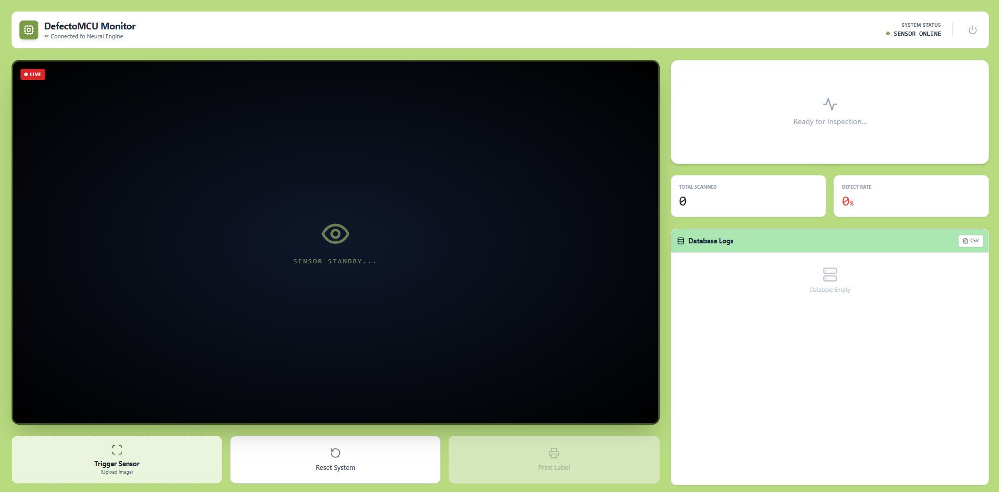
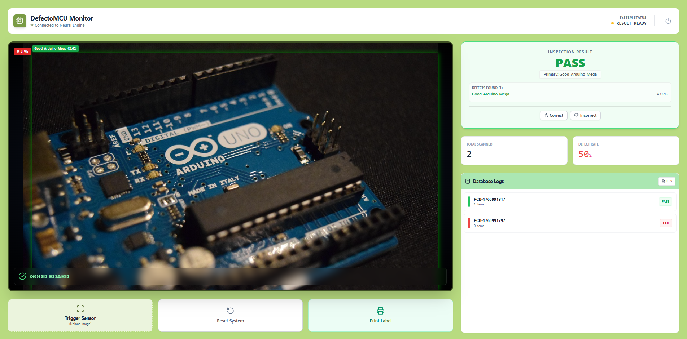
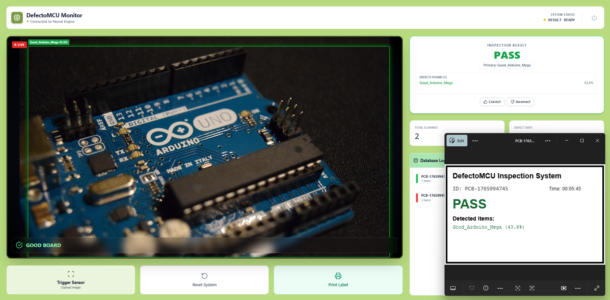
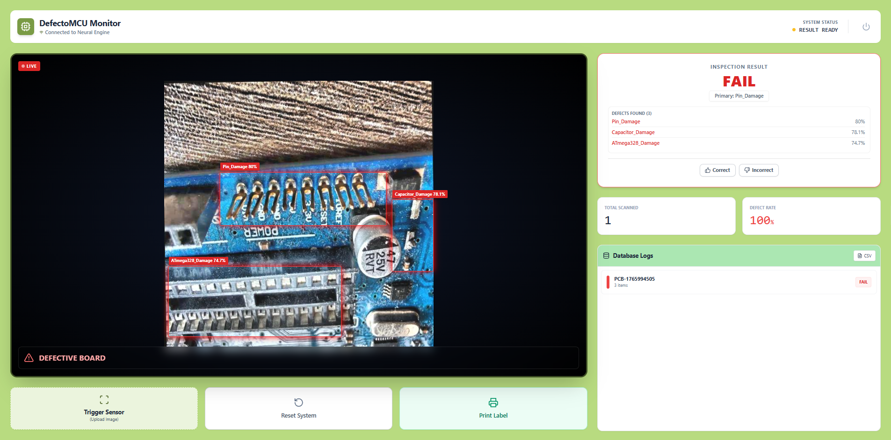
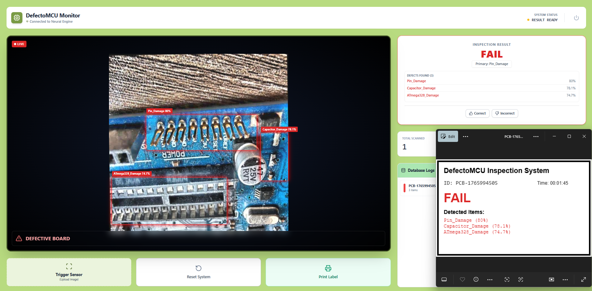

# DefectoMCU Inspection System

[](https://github.com/musfiqurR661/DefectoMCU-Web-/graphs/commit-activity) [](./LICENSE)

## Table of Contents

- [Project Description](#project-description)
- [Key Features](#key-features)
- [Tech Stack](#tech-stack)
- [Model Classes](#model-classes)
- [Screenshots & Demo](#screenshots--demo)
- [Folder Structure](#folder-structure)
- [Installation Instructions](#installation-instructions)
- [License](#license)

## Project Description

**DefectoMCU Inspection System** is a web-based Automated Optical Inspection (AOI) platform designed to detect physical defects in microcontroller boards (Arduino, ESP32) using Deep Learning. The system employs a React frontend for visualization and a Python FastAPI backend running a custom-trained YOLOv8 model (`best.pt`).

## Key Features

1. **Real-time AI Inference:**
   - Uploads PCB images to the backend, processes them with YOLOv8, and returns detection results instantly.
2. **Multi-Object Detection:**
   - Identifies and draws bounding boxes around multiple defects like bent pins and damaged capacitors simultaneously.
3. **Pass/Fail Logic:**
   - Automatically categorizes boards as "GOOD" or "DEFECTIVE" based on detection classes.
4. **Interactive Dashboard:**
   - Visual Monitor with bounding box overlays.
   - Displays confidence scores for each detection.
   - Database logging system (local storage simulation).
5. **Reporting & Actions:**
   - **Download Label:** Generates a printable PNG label/sticker with defect details and barcodes.
   - **Export CSV:** Exports inspection logs to a CSV file.
   - **Human-in-the-Loop:** Allows operators to verify AI results (Correct/Incorrect) for improved training.
6. **Backend Security:**
   - Custom fixes for PyTorch 2.6+ `WeightsUnpickler` security issues to load custom models safely.

## Tech Stack

- **Frontend:**
  - React.js (Vite)
  - Tailwind CSS
  - Lucide React (Icons)
- **Backend:**
  - Python
  - FastAPI
  - Uvicorn
  - PyTorch
  - Ultralytics YOLOv8
  - Pillow
- **AI Model:**
  - Custom YOLOv8n model trained for PCB defect detection.

## Model Classes

- **Good Boards:**
  - `Good_Arduino_Uno`, `Good_Arduino_Mega`, `Good_Arduino_Nano`, `Good_ESP32`.
- **Defects:**
  - `ATmega328_Damage`
  - `Capacitor_Damage`
  - `Pin_Damage`
  - `Power_Port_Damage`
  - `USB_Input_Damage`, etc.

## Screenshots & Demo

Below are some visual highlights of the DefectoMCU system:







## Folder Structure

```
/
├── frontend/     # React Vite frontend project
├── backend/      # FastAPI backend with model file `best.pt`
├── Images/       # Contains screenshots for documentation
```

## Installation Instructions

Follow these steps to set up the project on your local environment:

### Frontend Setup

1. Navigate to the frontend directory:
   ```bash
   cd frontend
   ```
2. Install dependencies:
   ```bash
   npm install
   ```
3. **Configuration (Important):**
   - Open `src/App.jsx`.
   - Locate the `fetch` API call (around line 1710).
   - Change the URL to your local backend if running locally:
     ```javascript
     // Change this:
     const response = await fetch('https://mrt661-defectomcu-api.hf.space/predict', { ... });
     
     // To this:
     const response = await fetch('http://127.0.0.1:8000/predict', { ... });
     ```
4. Start the development server:
   ```bash
   npm run dev
   ```

### Backend Setup

1. Navigate to the backend directory:
   ```bash
   cd backend
   ```
2. Place the YOLOv8 model file (`best.pt`) in the backend directory.
3. Install required Python packages:
   ```bash
   pip install -r requirements.txt
   ```
4. Start the backend server:
   ```bash
   uvicorn main:app --reload
   ```

## License

This project is licensed under the MIT License. See the [LICENSE](./LICENSE) file for details.
